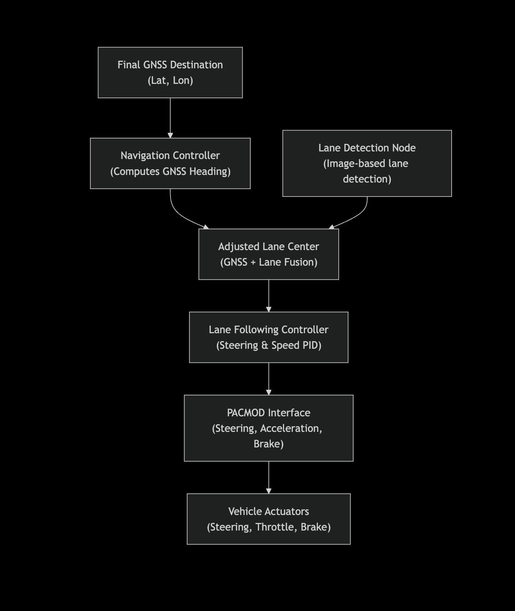
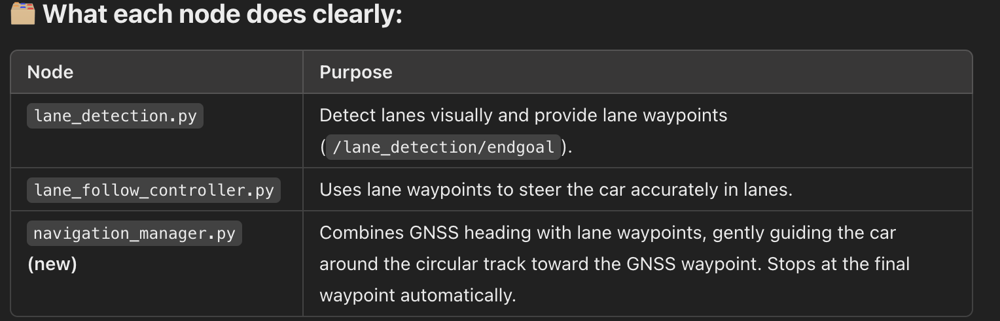

# Navigation Manager Documentation

## Navigation Methods

### 1. GNSS-based waypoint follower with Stanley controller and RTK enabled
- **Note:** RTK is not used in industry.

### 2. GNSS-based waypoint follower with Pure Pursuit controller

### 3. Vision-based (monovision camera) lane following using Stanley controller

---

## Navigation Manager Flowchart



---

## Python Implementation

### `navigation_manager.py`

```python
#!/usr/bin/env python3

import rospy
import numpy as np
import math
from std_msgs.msg import Bool
from pacmod_msgs.msg import PositionWithSpeed, PacmodCmd, VehicleSpeedRpt
from geometry_msgs.msg import PoseStamped
from sensor_msgs.msg import NavSatFix
from novatel_gps_msgs.msg import Inspva
import alvinxy.alvinxy as axy

class NavigationManager:
    def __init__(self):
        rospy.init_node('navigation_manager', anonymous=True)

        # GNSS final goal (latitude, longitude)
        self.final_lat = 40.0929000
        self.final_lon = -88.2360000

        # GNSS Origin (reference point)
        self.origin_lat = 40.0928563
        self.origin_lon = -88.2359994

        # Camera parameters
        self.image_width = 1280
        self.image_center_x = self.image_width / 2.0

        # Control parameters
        self.scaling_factor = 0.3
        self.stop_threshold = 2.0  # Distance to goal in meters

        # State variables
        self.current_lat = None
        self.current_lon = None
        self.current_heading = None
        self.lane_endgoal_x = self.image_center_x

        # Subscribers
        rospy.Subscriber('/novatel/inspva', Inspva, self.gnss_callback)
        rospy.Subscriber('/lane_detection/endgoal', PoseStamped, self.lane_callback)

        # Publishers
        self.pub_adjusted_endgoal = rospy.Publisher('/lane_detection/endgoal', PoseStamped, queue_size=1)
        self.brake_pub = rospy.Publisher('/pacmod/as_rx/brake_cmd', PacmodCmd, queue_size=1)
        self.accel_pub = rospy.Publisher('/pacmod/as_rx/accel_cmd', PacmodCmd, queue_size=1)

        # PACMOD Commands
        self.brake_cmd = PacmodCmd(enable=True, clear=False, ignore=False, f64_cmd=0.0)
        self.accel_cmd = PacmodCmd(enable=True, clear=False, ignore=False, f64_cmd=0.3)

        self.rate = rospy.Rate(10)
        self.run()

    def gnss_callback(self, msg):
        self.current_lat = msg.latitude
        self.current_lon = msg.longitude
        self.current_heading = np.radians(msg.azimuth)

    def lane_callback(self, msg):
        self.lane_endgoal_x = msg.pose.position.x

    def compute_gnss_heading(self):
        curr_x, curr_y = axy.ll2xy(self.current_lat, self.current_lon, self.origin_lat, self.origin_lon)
        goal_x, goal_y = axy.ll2xy(self.final_lat, self.final_lon, self.origin_lat, self.origin_lon)

        return math.atan2(goal_y - curr_y, goal_x - curr_x)

    def distance_to_goal(self):
        curr_x, curr_y = axy.ll2xy(self.current_lat, self.current_lon, self.origin_lat, self.origin_lon)
        goal_x, goal_y = axy.ll2xy(self.final_lat, self.final_lon, self.origin_lat, self.origin_lon)
        return np.hypot(goal_x - curr_x, goal_y - curr_y)

    def adjust_lane_goal(self):
        gnss_heading = self.compute_gnss_heading()
        heading_error = gnss_heading - self.current_heading
        heading_error = (heading_error + math.pi) % (2 * math.pi) - math.pi

        pixel_adjustment = heading_error * self.scaling_factor * self.image_width
        adjusted_endgoal_x = np.clip(self.lane_endgoal_x + pixel_adjustment, 0, self.image_width)

        endgoal_msg = PoseStamped()
        endgoal_msg.header.stamp = rospy.Time.now()
        endgoal_msg.pose.position.x = adjusted_endgoal_x
        endgoal_msg.pose.position.y = 0  # Unused

        self.pub_adjusted_endgoal.publish(endgoal_msg)

    def check_and_stop(self):
        if self.distance_to_goal() < self.stop_threshold:
            rospy.loginfo("Reached Goal! Stopping...")
            self.brake_cmd.f64_cmd = 0.8
            self.accel_cmd.f64_cmd = 0.0
            self.brake_pub.publish(self.brake_cmd)
            self.accel_pub.publish(self.accel_cmd)
            rospy.signal_shutdown("Reached Goal")

    def run(self):
        while not rospy.is_shutdown():
            if None in [self.current_lat, self.current_lon, self.current_heading]:
                self.rate.sleep()
                continue

            self.adjust_lane_goal()
            self.check_and_stop()
            self.rate.sleep()

if __name__ == '__main__':
    try:
        NavigationManager()
    except rospy.ROSInterruptException:
        pass
```

---

## Execution Order

The provided files and components should be executed in the following order:



---

*(End of document.)*